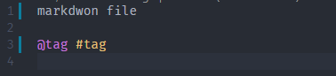

# VSCode Writing

A writing extension for myself.

## TODO

- [x] More highlight
- [x] Auto encrypt and decrypt files (vscode FileSystemProvider)
- [ ] Change password and re-encrypt all file

## Encrypt File System Provider

Use memory workspace to load an exist workspace. and sync with all edit action.

## More Highlight

